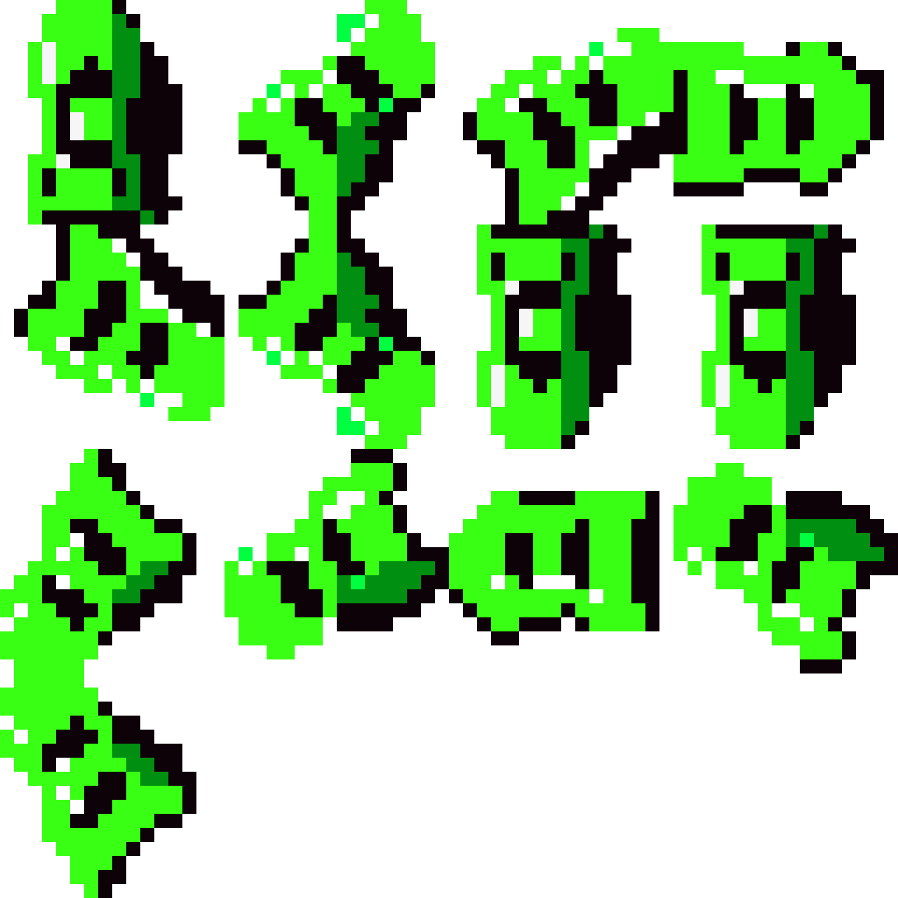
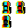
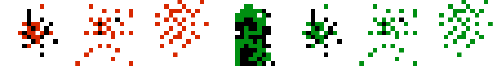
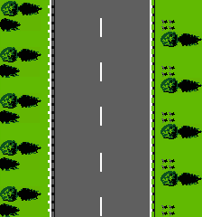
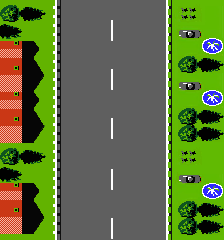
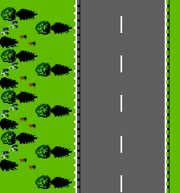
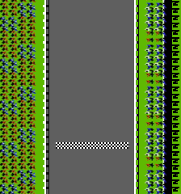
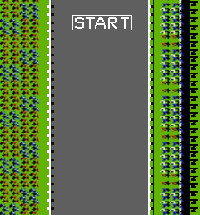
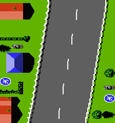
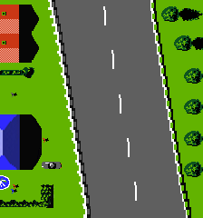

# Road Fighter - NES

## Galería de Sprites y Assets
Algunos estan zoomeados para ver mejor, las imagenes reales estan en los .piskel.

## Descripción del juego

Road Fighter es una reinterpretación de un juego de carreras clásico de la consola Nintendo Entertainment System (NES). El objetivo es completar varias etapas conduciendo un auto de carreras a través de una autopista mientras se esquivan otros vehículos, se sortean obstáculos y se recolecta combustible para no quedarse varado.

## Historia

En el mundo de las carreras clandestinas, un nombre es leyenda: **"The Player"**. Sos vos. El piloto más rápido, intocable e impredecible que la ciudad ha visto.

Tu dominio en el asfalto ha humillado a los sindicatos del crimen que controlan las calles. La implacable corporación conocida como **"Black Mesa"** ha decidido que ya no puede ganarte en una carrera limpia. La orden es simple: eliminarte.

Han puesto precio a tu cabeza y han enviado a sus mejores **"Cazadores"** a la carretera: un ejército de conductores desquiciados con una sola orden: sacarte del asfalto... para siempre.

Tu única oportunidad es usar tu habilidad al volante para atravesar sus territorios, evadir sus trampas y llegar a la meta final: la frontera de la ciudad, donde estarás a salvo. Esto ya no es una carrera. Es una lucha por la supervivencia.

## Mecánicas del juego

### Controles
El jugador controla un auto de carreras que se mueve horizontalmente por la pantalla. Se puede acelerar, frenar y mover el auto hacia la izquierda o derecha para cambiar de carril. La carretera se desplaza verticalmente hacia abajo, creando la sensación de que el auto avanza a alta velocidad.

### Obstáculos y enemigos
La autopista está llena de peligros enviados por Black Mesa para detenerte:

- **Cazadores**: Los pilotos de Black Mesa (3 tipos distintos de autos rivales). Intentarán cerrarte el paso y chocarte. No giran, solo se deslizan lateralmente.
- **Van Negra**: Un vehículo pesado y de gran tamaño que ocupa más espacio en la pista. Colisionar con ella tiene consecuencias graves.
- **Trampas en la vía**: Manchas de aceite que hacen perder el control y baches que dañan el auto.

Si el jugador choca contra algún vehículo, pierde velocidad y control, consumiendo un valioso tiempo de carrera.

### Sistema de combustible
En esta carrera por tu vida, el recurso más valioso no es la salud, **es el tiempo**. El tanque de combustible no es solo gasolina, es el reloj de la carrera.

- El combustible disminuye constantemente a medida que avanzas. Si llega a cero, el tiempo se agota y Black Mesa te atrapa. **Fin del juego.**
- **Chocar no es morir, es perder tiempo**: Cuando chocás, sufrís un revés que te hace perder velocidad. El tiempo y combustible que gastás en recuperarte y volver a acelerar es tu verdadero castigo. El juego no termina al chocar, pero cada error te acerca más al final.
- En la pista aparecen items especiales de colores (ítems "FUEL") que deben recogerse para recargar el tanque y ganar segundos extra de vida.

### Puntuación y progresión
- Los puntos se acumulan al pasar otros vehículos.
- Cada etapa tiene una meta que debe alcanzarse antes de quedarse sin combustible.
- El juego aumenta su dificultad en etapas posteriores con más tráfico y patrones más complejos.

## Las 4 Etapas del Escape

El escape hacia la frontera cruza cuatro territorios controlados por Black Mesa. Cada uno tiene un estilo visual único y una dificultad creciente.

### Etapa 1: "La Huida" (Campo/Suburbios)
La carrera comienza en las afueras de la ciudad. Un tramo inicial para que el jugador se familiarice con los controles.
- **Carretera**: Asfalto gris oscuro, de 2 a 3 carriles. Líneas blancas o amarillas.
- **Bordes**: Césped verde vibrante. Árboles de diseño sencillo y alguna valla de madera.
- **Paleta de colores**: Verdes, grises y azul brillante del cielo. Colores primarios y alegres. Es de día.
- **Atmósfera**: Optimista, el inicio de la aventura. Dificultad baja.

### Etapa 2: "El Puente" (Viaducto sobre el Agua)
El jugador abandona el campo y cruza un largo puente. El espacio se siente más claustrofóbico.
- **Carretera**: Mismo asfalto, pero los bordes son las barreras del puente.
- **Bordes**: Barandillas de metal u hormigón. Afuera se ve el agua azul profundo del mar.
- **Paleta de colores**: Grises del asfalto y hormigón, azules del agua y el cielo.
- **Atmósfera**: La tensión aumenta. No hay escapatoria a los lados.

### Etapa 3: "La Costa de la Muerte" (Carretera Costera)
La etapa más difícil. Una carretera junto al mar, llena de curvas peligrosas y tráfico intenso.
- **Carretera**: Asfalto con defectos: parches de aceite, baches y grietas visuales.
- **Bordes**: De un lado, una pared de roca o montaña. Del otro, el mar abierto con rocas o playa. Peligro asimétrico.
- **Paleta de colores**: Tonos ocres y marrones para la montaña, azul turquesa para el mar. Cielo de atardecer (naranjas, violetas).
- **Atmósfera**: Tensa, peligrosa, frustrante.

### Etapa 4: "El Desafío del Bosque" (Montaña/Bosque)
El tramo final. Una carretera sinuosa que atraviesa una zona boscosa y montañosa.
- **Carretera**: Similar a la primera etapa, pero más estrecha y con más curvas.
- **Bordes**: Tierra, césped oscuro y una densa arboleda a ambos lados. Los árboles proyectan sombras sobre la calzada.
- **Paleta de colores**: Verdes oscuros, marrones de los troncos y gris de la carretera. El cielo apenas se ve entre las copas.
- **Atmósfera**: Último desafío de resistencia y precisión. Menos caótico que la costa, pero más exigente.

## Sprites

| Sprite | Descripción | Frames |
|--------|-------------|--------|
| **Auto The Player** | Auto del jugador. Incluye rotación completa y animación de choque. | 12 rotación + 4 choque = 16 |
| **Cazador Tipo 1** | Auto rival de Black Mesa, silueta única. Se desliza lateralmente. | 1 |
| **Cazador Tipo 2** | Auto rival de Black Mesa, segunda silueta. | 1 |
| **Cazador Tipo 3** | Auto rival de Black Mesa, tercera silueta. | 1 |
| **Van Negra** | Vehículo pesado de gran tamaño, obstáculo móvil. | 1 |
| **Mancha de aceite** | Obstáculo de pista que hace perder el control. | 1 |
| **Bache** | Obstáculo de pista que daña el auto. | 1 |
| **Ítem de combustible** | item especial de colores que recarga el tanque. | 1 |
| **Auto indicador (UI)** | Auto visto desde arriba, sin girar, para la interfaz de progreso. | 1 |
| **Bandera de inicio** | Marcador visual del comienzo de la etapa (mismo sprite que la de meta, color diferenciado). | 1 |
| **Bandera de meta** | Marcador visual del final de la etapa (mismo sprite que la de inicio, color diferenciado). | 1 |

## Características visuales

- Resolución de pantalla: **320 x 240 píxeles**
- Profundidad de color: **8 bits por píxel** (paleta finita)
- Vista aérea vertical (desde arriba)
- Carretera con múltiples carriles
- Diferentes tipos de terreno (asfalto, pasto, agua, roca, bosque) según la etapa
- Sprites coloridos para los vehículos y elementos del juego
- Interfaz que muestra puntuación, combustible y etapa actual, con un indicador de progreso mediante banderas
